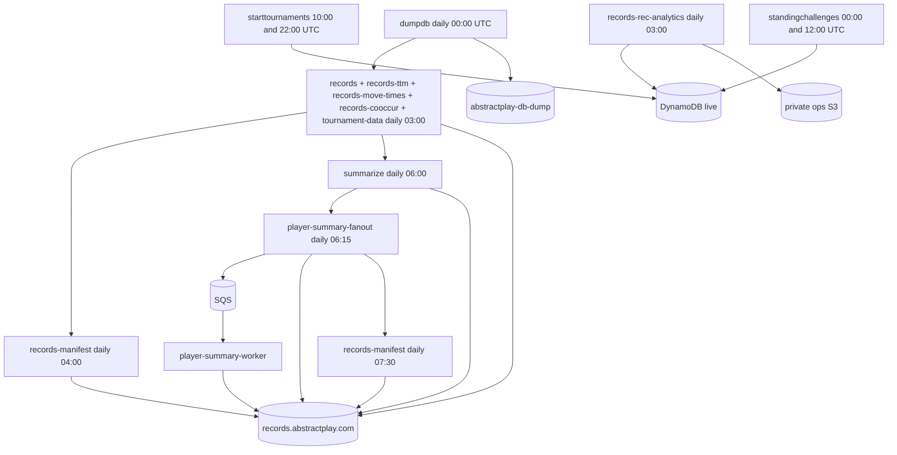

# Records pipeline

The batch pipeline runs **daily** (UTC) against the latest completed DynamoDB export in `abstractplay-db-dump`. Downstream jobs at 03:00 use whichever export finished most recently (by `manifest-summary.json` `LastModified`) — not necessarily the export started at that day's midnight `dumpdb` run.

## Schedule overview

All times UTC. Prod only.

EventBridge cron expressions use `*` in the day-of-month field (daily). For example, `cron(0 0 * * ? *)` is **every day** at 00:00, not Sunday-only. Sunday-only would be `cron(0 0 ? * SUN *)`.

| Time | Function(s) | Depends on |
|------|-------------|------------|
| Daily 00:00 | `dumpdb` | — |
| Daily 03:00 | `records`, `records-ttm`, `records-move-times`, `records-cooccur`, `records-rec-analytics`, `tournament-data` | Latest completed dump in `abstractplay-db-dump` (except `records-rec-analytics` — live DDB scan) |
| Daily 04:00 | `records-manifest` | Records batch outputs |
| Daily 06:00 | `summarize` | `ALL.json` in records bucket |
| Daily 06:15 | `player-summary-fanout` | Enqueues `player/*-summary.json` writes via SQS |
| Daily 07:30 | `records-manifest` | Post-summarize + player-slice refresh |

Live crons (`starttournaments`, `standingchallenges`) run on separate daily schedules and query DynamoDB directly — see [Live crons](/crons/live-crons/).

## Flow diagram

## Step 1: Database export (`dumpdb`)

Triggers a DynamoDB **point-in-time export** of the prod table (`abstract-play-prod`) to S3 bucket `abstractplay-db-dump` in ION format. AWS writes export files under `AWSDynamoDB/{uid}/data/*.ion.gz` plus a `manifest-summary.json`.

The export is asynchronous — downstream jobs find the **latest** manifest by `LastModified` and process all data files for that export UID. Exports older than seven days are pruned by `dumpdb`.

## Step 2: Parallel record generation (daily 03:00)

Five Lambdas run in parallel at 03:00 UTC. Each reads the latest completed dump independently (they do not wait for each other's outputs).

### `records`

Reads GAME, TOURNAMENT, ORGEVENT, ORGEVENTGAME, and BOT records from the ION dump. For each completed game (`pk=GAME`, `sk` contains `#1#`), instantiates the rules engine via `GameFactory` and calls `genRecord()` to produce an [`APGameRecord`](/recranks/).

Writes to `records.abstractplay.com`:

- `ALL.json` — all game records
- `meta/{metaGame}.json` — per-game-type lists
- `player/{playerId}.json` — per-player lists
- `event/{eventId}.json` — tournament/event groupings

### `records-ttm`

Same dump ingestion, but computes per-player inter-move durations from the game stack. Writes `ttm/{playerId}.json` (array of milliseconds).

### `records-move-times`

Builds move-activity summaries over 7, 30, 180, and 365-day windows, plus site-wide move-time seasonality (DOW/hour bins) and **`weeklyActiveMovers`** (distinct players with ≥1 move per seven-day bucket). Writes `mvtimes.json`.

### `records-cooccur`

Scans completed GAME records and `USER` records (for `stars[]`) from the dump. Builds a PMI-normalized co-occurrence matrix for the front-end recommendation engine. Writes `recommendations/cooccur.json`. See [Recommendation co-occurrence](/crons/recommendations-cooccur/).

### `records-rec-analytics`

Scans live DynamoDB `RECOMMENDS#` impression events (not the ION dump). Computes anonymized funnel/CTR rollups and writes to the private ops bucket. See [Recommendation analytics](/crons/recommendations-analytics/).

### `tournament-data`

Extracts tournament records from the dump and writes `tournament-summary.json` plus `player/tournaments/{playerId}.json` per player.

## Step 3: Manifest and CDN (`records-manifest`)

Lists all objects in the records bucket, writes `_manifest.json` (v2 schema with `summaryFiles`). Does **not** invalidate CloudFront; see [S3 outputs — caching](/crons/s3-outputs/#cloudfront-and-caching). Runs at **04:00** and **07:30 UTC** so the late pass includes `_summary.json`, tier files, and `player/*-summary.json` from the summarize / fan-out pipeline.

## Step 4: Summarize (daily 06:00)

Reads `ALL.json`, computes site-wide analytics, writes `_summary.json` and tier files. See [Summarize](/crons/summarize/).

## Step 5: Player summary fan-out (daily 06:15)

`player-summary-fanout` loads `_summary-site.json`, `_summary-players.json`, and `_summary-ratings.json` in parallel (not the full monolith). It compares per-player content hashes against the previous `_summary-player-manifest.json` (v2) and enqueues SQS messages only for slices whose substantive content changed. When tier input is unchanged from the prior run, it skips all enqueues.

`player-summary-worker` Lambdas (SQS-triggered, concurrency 25) write `player/{userId}-summary.json`. The handler returns structured metrics (`candidateCount`, `enqueuedCount`, `skippedCount`, `inputUnchanged`, `tierBytesLoaded`, `manifestBytes`) and logs a one-line summary.

## Failure and timing

- `dumpdb` starts at 00:00; the 03:00 batch uses the latest **completed** export, which may be from the previous day if today's export is still running
- If `records` fails, `ALL.json` is stale and `summarize` reflects old data
- `records-manifest` writes `_manifest.json` with current S3 listing — clients see whatever is at the origin after cache revalidation (no blanket invalidation)

## Related

- [Functions reference](/crons/functions/)
- [S3 outputs](/crons/s3-outputs/)
- [Recommendation co-occurrence](/crons/recommendations-cooccur/)
- [Recommendation analytics](/crons/recommendations-analytics/)
- [Summarize](/crons/summarize/)
